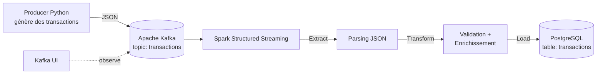

# Real-Time ETL Pipeline

Pipeline ETL (Extract, Transform, Load) temps réel qui ingère des transactions financières simulées, les traite en streaming avec Apache Spark, et les persiste dans une base PostgreSQL — le tout orchestré avec Docker Compose.

## Sommaire

- [Architecture](#architecture)
- [Stack technique](#stack-technique)
- [Structure du projet](#structure-du-projet)
- [Prérequis](#prérequis)
- [Installation](#installation)
- [Utilisation](#utilisation)
- [Schéma de données](#schéma-de-données)
- [Visualisation](#visualisation)
- [Dépannage](#dépannage)

## Architecture



**Flux de données :**

1. **Producer** (`producer/producer.py`) génère des transactions factices toutes les 2 secondes et les envoie à Kafka
2. **Kafka** (`etl-kafka`) reçoit et stocke temporairement les messages dans le topic `transactions`
3. **Spark Structured Streaming** (`spark/`) lit le topic en continu et applique le pipeline ETL :
   - **Extract** — parsing du JSON brut en colonnes structurées (`transformation.py`)
   - **Transform** — validation des données, catégorisation des montants, enrichissement avec un horodatage de traitement (`transformation.py`)
   - **Load** — écriture de chaque micro-batch dans PostgreSQL via JDBC (`load.py`)
4. **PostgreSQL** (`etl-postgres`) stocke durablement les transactions transformées, prêtes à être interrogées
5. **Kafka UI** offre une interface web pour observer les topics et messages en transit

## Stack technique

| Composant | Rôle | Image Docker |
|---|---|---|
| Apache Kafka | Message broker (KRaft, sans Zookeeper) | `apache/kafka:4.0.0` |
| Apache Spark | Moteur de traitement streaming | `apache/spark:4.0.0` |
| PostgreSQL | Base de données relationnelle | `postgres:16` |
| Kafka UI | Interface de supervision Kafka | `provectuslabs/kafka-ui` |
| Python | Producer de données + client Kafka | `kafka-python` |

## Structure du projet

```
real-time-etl-pipeline/
├── architecture/              # Schémas et diagrammes du pipeline
├── config/                    # Configurations externalisées
├── database/
│   ├── init.sql                # Script d'initialisation exécuté au 1er démarrage de Postgres
│   └── schema.sql               # Définition de la table transactions
├── docs/                       # Documentation complémentaire
├── producer/
│   └── producer.py              # Générateur de transactions -> Kafka
├── scripts/                    # Scripts utilitaires (setup, tests manuels)
├── spark/
│   ├── Dockerfile               # Image Spark + dépendances (Kafka, JDBC Postgres)
│   ├── streaming_job.py         # Orchestrateur : Extract -> Transform -> Load
│   ├── transformation.py        # Logique Extract + Transform (parsing, validation, enrichissement)
│   └── load.py                  # Logique Load (écriture JDBC vers Postgres)
├── tests/                      # Tests unitaires
├── .env.example                 # Exemple de variables d'environnement
├── .gitignore
├── docker-compose.yml            # Orchestration de tous les services
├── requirements.txt              # Dépendances Python (producer)
└── README.md
```

## Prérequis

- [Docker Desktop](https://www.docker.com/products/docker-desktop/) (avec Docker Compose)
- Python 3.10+ (pour lancer le producer localement)
- ~4 Go de RAM disponible pour les conteneurs

## Installation

**1. Cloner le dépôt**
```bash
git clone https://github.com/Hajarfallaki/Real-time-etl-pipeline.git
cd real-time-etl-pipeline
```

**2. Installer les dépendances du producer**
```bash
cd producer
pip install -r ../requirements.txt
cd ..
```

**3. Lancer l'infrastructure**
```bash
docker compose up -d --build
```

Cette commande démarre 4 services : `etl-postgres`, `etl-kafka`, `etl-kafka-ui`, `etl-spark`.

> La table `transactions` est créée automatiquement au premier démarrage via `database/schema.sql`.

**4. Créer le topic Kafka**

Au premier démarrage (ou après un `docker compose down -v`), le topic doit être créé manuellement :
```bash
docker exec -it etl-kafka /opt/kafka/bin/kafka-topics.sh \
  --create --topic transactions \
  --bootstrap-server localhost:9092 \
  --partitions 1 --replication-factor 1
```

## Utilisation

**Lancer le producer** (génère une transaction toutes les 2 secondes)
```bash
cd producer
python producer.py
```

**Suivre le traitement Spark en temps réel**
```bash
docker logs -f etl-spark
```

**Consulter les données chargées dans Postgres**
```bash
docker exec -it etl-postgres psql -U etl_user -d etl_db \
  -c "SELECT * FROM transactions ORDER BY processed_at DESC LIMIT 10;"
```

**Arrêter l'infrastructure**
```bash
docker compose down
```

**Tout réinitialiser** (supprime aussi les données Postgres)
```bash
docker compose down -v
```

## Schéma de données

**Message Kafka brut (JSON)**
```json
{
  "transaction_id": "TX0001",
  "customer_id": "C035",
  "amount": 1084.48,
  "type": "PAYMENT",
  "status": "FAILED",
  "timestamp": "2026-09-14T01:59:16.312914+00:00"
}
```

**Table `transactions` (PostgreSQL, après transformation)**

| Colonne | Type | Origine | Description |
|---|---|---|---|
| `transaction_id` | `VARCHAR(20)` | Kafka | Identifiant unique de la transaction |
| `customer_id` | `VARCHAR(10)` | Kafka | Identifiant du client |
| `amount` | `NUMERIC(10,2)` | Kafka | Montant de la transaction |
| `type` | `VARCHAR(20)` | Kafka | PAYMENT / TRANSFER / WITHDRAWAL / DEPOSIT |
| `status` | `VARCHAR(20)` | Kafka | SUCCESS / FAILED |
| `event_timestamp` | `TIMESTAMPTZ` | Kafka (casté) | Horodatage d'émission de la transaction |
| `amount_category` | `VARCHAR(10)` | **Calculée par Spark** | small (< 100) / medium (< 1000) / large |
| `processed_at` | `TIMESTAMPTZ` | **Générée par Spark** | Horodatage du traitement ETL |

**Règles de transformation appliquées** (`spark/transformation.py`) :
- Rejet des transactions avec `transaction_id` ou `customer_id` manquant
- Rejet des transactions avec `amount <= 0`
- Catégorisation automatique du montant (`small` / `medium` / `large`)
- Ajout d'un horodatage de traitement (`processed_at`)

## Visualisation

**Kafka UI** — inspection des topics, messages et statistiques
```
http://localhost:8080
```

**Spark UI** — suivi des jobs et micro-batches en cours
```
http://localhost:4040
```

## Dépannage

**Le job Spark plante avec `UnknownTopicOrPartitionException`**
Le topic Kafka n'existait pas encore au démarrage de Spark. Créez-le (voir [Installation](#installation) étape 4) puis redémarrez le conteneur :
```bash
docker start etl-spark
```

**La table `transactions` n'existe pas dans Postgres**
Le volume Postgres existait déjà avant l'ajout de `database/schema.sql`, empêchant sa ré-exécution automatique. Réinitialisez :
```bash
docker compose down -v
docker compose up -d --build
```

**`localhost:9092` ou `localhost:5432` ne répond pas dans le navigateur**
Normal — Kafka et PostgreSQL utilisent des protocoles binaires, pas du HTTP. Utilisez `psql`/`kafka-topics.sh` en ligne de commande, ou Kafka UI (port 8080) pour l'inspection visuelle.

## Auteur

Hajar ELFALLAKI-IDRISSI
